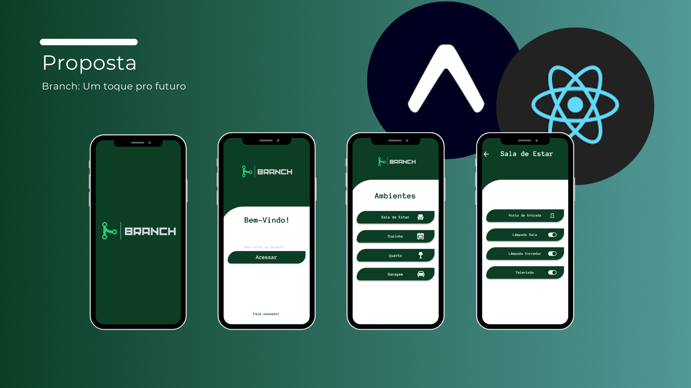

# Branch - Automação Residencial

O projeto integrador é uma ferramenta chamada Branch, que vem da ideia de ramificação. Porém, essa ferramenta ela surge para atender a necessidade de ambientes autogeridos na ramificação do aplicativo, e fazer o controle de forma domótica dos ambientes. Além de fazer o controle de acesso por hardware e por metodológia de permissões no aplicativo.

## 📦 Implantação

O aplicativo foi implementado com base em um protótipo desenvolvido e aprimorado em sala de aula, com a finalidade de desenvolvermos softskills e expertise para o mercado de trabalho;

Este foi o protótipo desenvolvido e validado:

## 🛠️ Construído com

Mencione as ferramentas que você usou para criar seu projeto

* [Expo](https://docs.expo.dev/) 
* [React Native](https://reactnative.dev/docs/environment-setup)
* [Supabase](https://supabase.com/docs)

## ✒️ Autores

* **thsethub** - *Trabalho Inicial* e *Documentação*- [Thiago Augusto](https://github.com/thsethub)

## 📄 Licença

Este projeto está sob a licença (MIT license) - veja o arquivo [LICENSE.md]((https://github.com/thsethub/Branch/tree/main?tab=MIT-1-ov-file)) para detalhes.

---
⌨️ por [Thiago Augusto](https://github.com/thsethub) 😊
